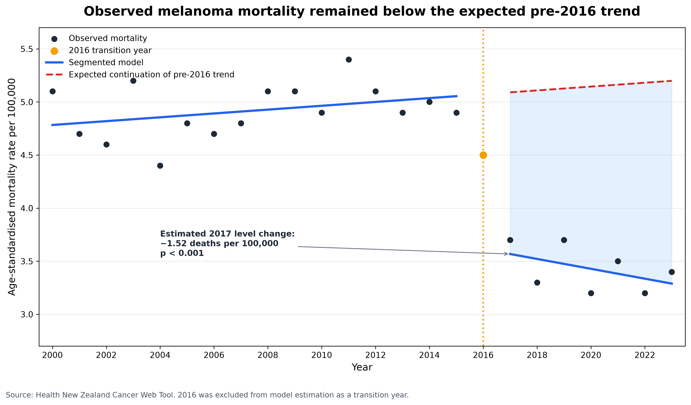
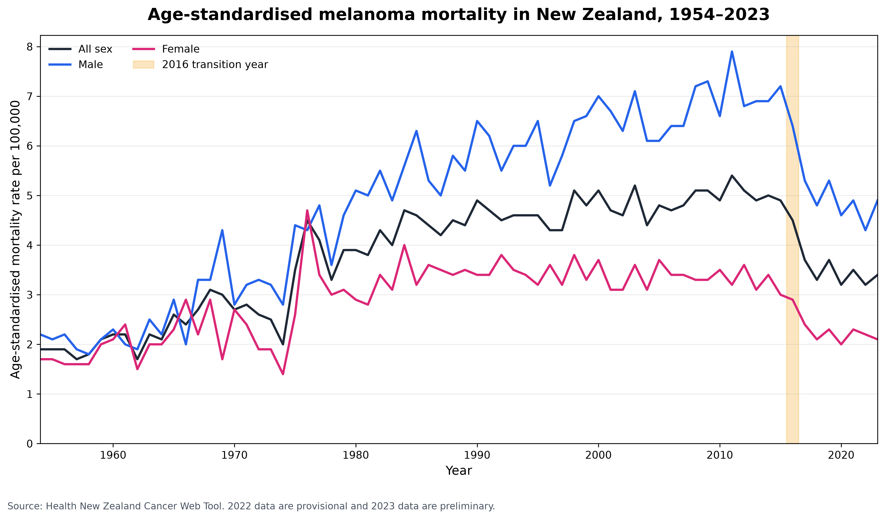

# Long-Term Trends in Melanoma Mortality in New Zealand

## Before and After the Introduction of Modern Systemic Therapies

## Overview

New Zealand has one of the world’s highest melanoma burdens. During 2016, modern immune checkpoint inhibitors became publicly funded for eligible patients with advanced melanoma, including nivolumab from July and pembrolizumab from September.

This project examines whether their introduction coincided with a temporary or sustained change in melanoma mortality at the population level.

## Project Outputs

* [Executive report](NZ_Melanoma_Mortality_Report.pdf)
* [Reproducible Jupyter Notebook](NZ_Melanoma_Mortality_Analysis.ipynb)

## Research Question

**Was the introduction of modern systemic therapies for melanoma in New Zealand during 2016 associated with a temporary or sustained change in melanoma mortality?**

## Data

Annual melanoma mortality data were obtained from the [Health New Zealand Cancer Web Tool](https://www.healthnz.govt.nz/about-us/health-data/data-sets-and-collections/cancer-data-and-statistics/cancer-web-tool).

The dataset contains:

* Annual melanoma deaths from 1954 to 2023
* Age-standardised mortality rates per 100,000
* Results for all sexes, males, and females
* Melanoma classified using ICD-10 code C43

Rates were directly age-standardised using the WHO standard world population. Data for 2022 are provisional and data for 2023 are preliminary.

## Treatment-Transition Year

The year 2016 was treated as a transition year because nivolumab and pembrolizumab became publicly funded during that year.

The primary comparison used:

* Pre-introduction period: up to 2015
* Transition year: 2016
* Post-introduction period: 2017 onwards

## Analytical Methods

The analysis included:

* Data-quality and completeness checks
* Descriptive comparison of mortality before and after 2016
* Long-term trend visualisation from 1954 to 2023
* Primary segmented regression using 2000–2023 data
* Exclusion of 2016 from regression estimation
* HAC standard errors with two lags
* Counterfactual projection of the pre-2016 trend
* Sensitivity analyses with post-periods beginning in 2017, 2018, and 2019
* Sex-stratified regression models
* Residual and regression diagnostics

## Key Findings

* The mean all-sex age-standardised mortality rate was **30.2% lower** during 2017–2020 and **32.3% lower** during 2021–2023 compared with 2012–2015.
* The primary segmented model estimated an immediate reduction of **1.523 deaths per 100,000** in 2017 relative to continuation of the pre-2016 trend.
* The estimated level change was statistically significant: **95% CI −1.765 to −1.281; p < 0.001**.
* The estimated post-introduction trend remained negative at **−0.046 deaths per 100,000 per year; p = 0.001**.
* The primary model explained **91.3%** of the observed variation.
* Sensitivity analyses consistently found a significant level reduction when the post-period began in 2017, 2018, or 2019.
* Significant reductions were observed among both males and females.
* Observed mortality remained below the modelled continuation of the pre-2016 trend through 2023.

## Main Result



The persistent difference between observed post-introduction mortality and the counterfactual continuation of the earlier trend supports a sustained rather than temporary reduction.

## Long-Term Trend



Mortality remained consistently higher among males than females. A marked reduction was observed around the 2016 transition across all three sex groups.

## Project Structure

```text
nz-melanoma-mortality-trends/
├── NZ_Melanoma_Mortality_Analysis.ipynb
├── NZ_Melanoma_Mortality_1954_2023_HealthNZ.xlsx
├── NZ_Melanoma_Mortality_Report.pdf
├── README.md
├── requirements.txt
├── data/
│   └── NZ_Melanoma_Mortality_Cleaned_1954_2023.csv
├── figures/
│   ├── Figure1_Long_Term_Melanoma_Mortality_by_Sex.png
│   ├── Figure2_Melanoma_Mortality_Around_2016.png
│   ├── Figure3_Segmented_Regression_and_Counterfactual.png
│   └── Figure4_Segmented_Model_Diagnostics.png
└── tables/
    ├── Table1_Descriptive_Period_Comparison.csv
    ├── Table2_Primary_Segmented_Regression.csv
    ├── Table3_Lag_Sensitivity_Analysis.csv
    ├── Table4_Sex_Stratified_Models.csv
    ├── Table5_Model_Diagnostics.csv
    └── Primary_Segmented_Regression_Full_Summary.txt
```

## Reproducing the Analysis

Create a Python environment, install the required packages, and run the notebook from top to bottom:

```bash
python -m pip install -r requirements.txt
```

The notebook expects the original Excel file to remain in the repository root. Generated data, figures, and tables are written to their corresponding folders.

## Interpretation

The results provide consistent population-level evidence that the introduction of modern systemic therapies during 2016 coincided with a large and sustained reduction in melanoma mortality in New Zealand.

The decline persisted throughout the available post-introduction period, remained robust under alternative lag assumptions, and was observed among both males and females.

## Limitations

* This ecological analysis cannot identify which individuals received treatment.
* Patient-level stage, treatment, survival, and tumour information were unavailable.
* Public funding does not necessarily indicate immediate or uniform treatment uptake.
* Prevention, early detection, diagnosis, surgery, referral pathways, and supportive care may also have affected mortality.
* Only seven post-introduction years were available.
* The 2022 and 2023 mortality data were not yet final.
* The counterfactual depends on continuation of the pre-2016 linear trend.
* Temporal association does not establish causation.

## Conclusion

The introduction of modern systemic therapies for melanoma in New Zealand during 2016 was associated with a substantial and sustained reduction in age-standardised melanoma mortality.

The available evidence supports a sustained rather than temporary population-level change. Patient-level treatment and survival data would be required to estimate the contribution of individual therapies.

## Sources

* [Health New Zealand Cancer Web Tool](https://www.healthnz.govt.nz/about-us/health-data/data-sets-and-collections/cancer-data-and-statistics/cancer-web-tool)
* [Interactive Cancer Web Tool](https://tewhatuora.shinyapps.io/cancer-web-tool/)
* [PHARMAC](https://pharmac.govt.nz/)
* [New Zealand Pharmaceutical Schedule](https://schedule.pharmac.govt.nz/)

## Author

**Zohreh Riahi**
Laboratory Scientist and Health Data Analyst
New Zealand
